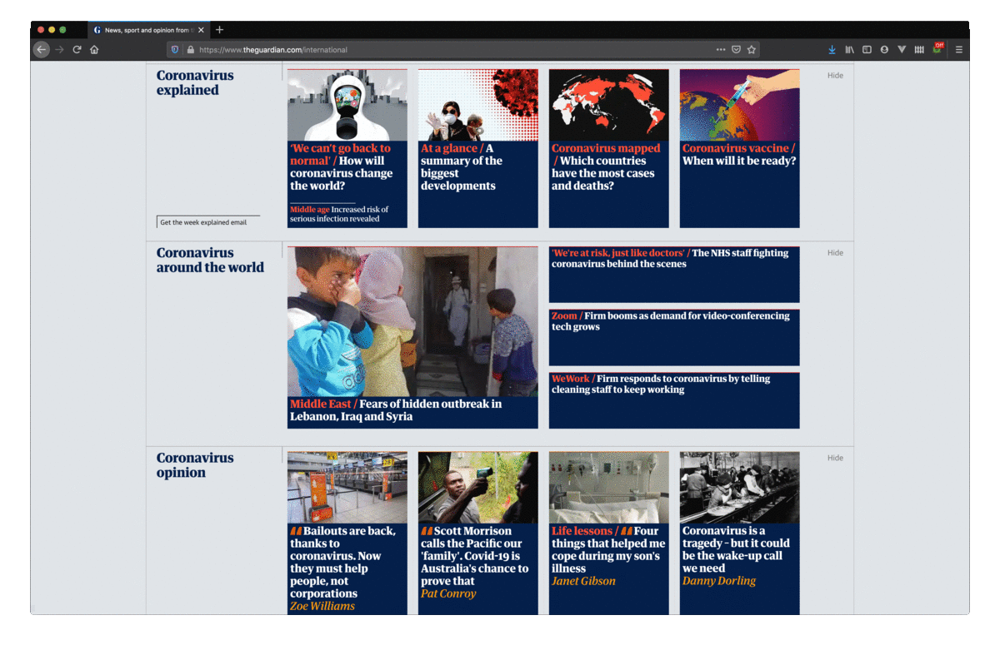

# COVID Pause (Firefox Port)

Ported from Kyle McDonald's original Chrome version: [kylemcdonald/COVIDPause](https://github.com/kylemcdonald/COVIDPause/)

This extension removes content from websites that contain the following keywords:

* "COVID"
* "corona" or "virus",
* "quarantine" or "lockdown"
* "pandemic"

Additional words may be added at the top of `content.js` as appropriate.

Some special cases are handled on some of the most popular English-language websites to remove content at the card/article level, instead of removing the text alone.

## Install

1. Download [this file](https://github.com/dpkn/COVIDPause/raw/master/web-ext-artifacts/covid_pause-1.0-an%2Bfx.xpi).
2. In your browser, go to `about:addons`, or from the menu bar select "Tools > Add-ons".
3. At the top right, click the settings icon and navigate to "Install Add-On from File..."
5. Select the downloaded .xpi file
6. Grant permission!

Or, built it yourself from this repository using [mozilla/web-ext](https://github.com/mozilla/web-ext)

## Usage

To temporarily enable/disable COVID Pause, click the COVID Pause icon at the top right.
